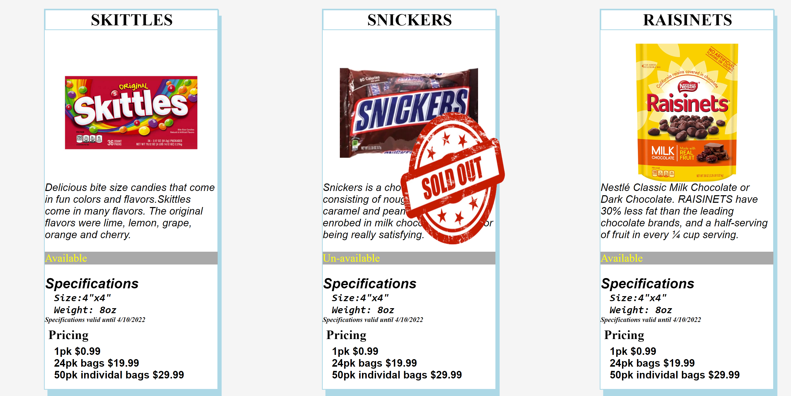

# PRODUCT-CARDS
## Description
 This project was the beginning of learning how to create cards using div and containers. We created cards using index.html to create the layout.  We did not use any js code in this learning phase. We also learned how to overlay images.
## screenshots

## How to run
1. Clone down this repo
1. Make sure you have http-server installed via npm. If not get it [HERE] (https://www.npmjs.com/package/http-server)
1. On your command line run `hs -p 9999`
1. In your browser go to http://localhost:9999
